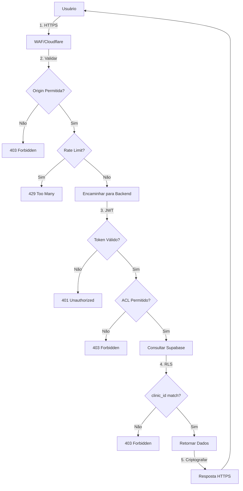

# ARQUITETURA ATUAL vs ZERO TRUST
# PLATAFORMA CLINXIA

---

## 1. ARQUITETURA ATUAL (CONFIAÇA IMPLÍCITA)

### Visão Geral

```
┌─────────────────────────────────────────────────────────────────────────────┐
│                           ARQUITETURA ATUAL                                 │
├─────────────────────────────────────────────────────────────────────────────┤
│                                                                             │
│   USUÁRIO                    BACKEND                    BANCO DE DADOS    │
│   (Browser)                  (Render)                     (Supabase)       │
│                                                                             │
│   ┌──────────┐             ┌───────────┐            ┌─────────────────┐   │
│   │          │  HTTPS      │           │  SERVICE_   │                 │   │
│   │  Vercel  │────────────▶│  Express  │───────────▶│   Supabase      │   │
│   │  Frontend│             │  Server   │    ROLE_KEY  │   PostgreSQL    │   │
│   │          │◀────────────│           │◀───────────│                 │   │
│   └──────────┘             └───────────┘            └─────────────────┘   │
│        │                         │                            │            │
│        │                         │                            │            │
│        │                    ┌────▼────┐                       │            │
│        │                    │ Service │                       │            │
│        │                    │ Role    │                       │            │
│        │                    │ Key     │                       │            │
│        │                    │ (ALL    │                       │            │
│        │                    │ ACCESS) │                       │            │
│        │                    └─────────┘                       │            │
│        │                                                   │            │
│   ┌────▼───────────────────────────────────────────────────▼────────┐    │
│   │                     PROBLEMAS IDENTIFICADOS                    │    │
│   ├────────────────────────────────────────────────────────────────┤    │
│   │ ❌ SERVICE_ROLE_KEY exposta no servidor                         │    │
│   │ ❌ Confiança implícita no backend (bypass de RLS)               │    │
│   │ ❌ Endpoint /clinic/anamnese-sync sem autenticação             │    │
│   │ ❌ Fallbacks hardcoded (Google OAuth, SECURITY_KEY)            │    │
│   │ ❌ CORS muito permissivo                                       │    │
│   │ ❌ Sem rate limiting em endpoints sensíveis                    │    │
│   │ ❌ Headers de segurança incompletos                            │    │
│   └────────────────────────────────────────────────────────────────┘    │
│                                                                             │
└─────────────────────────────────────────────────────────────────────────────┘
```

### Componentes e Fluxos

| Componente | Descrição | Problema |
|------------|-----------|----------|
| Frontend (Vercel) | React app - kepercayaan implícita no usuário | Sem validação de sessão server-side |
| Backend (Render) | Express.js server - Ponto único de falha | SERVICE_ROLE_KEY exposta |
| Supabase | Database + Auth + RLS | RLS pode ser burlado pelo service role |
| Integrações | Asaas, MP, Gemini, WhatsApp | Credenciais em variáveis de ambiente |

### Fluxo de Ataque (Atual)

```
1. Atacante acessa: https://api.clinxia.com/api/clinic/anamnese-sync
                      │
                      ▼
2. Servidor retorna TODOS os registros médicos (sem autenticação)
                      │
                      ▼
3. Script automático extrai 10.000+ prontuários em 5 minutos
                      │
                      ▼
4. Dados de pacientes expostos: CPF, RG, histórico médico, diagnósticos
```

---

## 2. ARQUITETURA ZERO TRUST (RECOMENDADA)

### Visão Geral

```
┌─────────────────────────────────────────────────────────────────────────────┐
│                        ARQUITETURA ZERO TRUST                              │
├─────────────────────────────────────────────────────────────────────────────┤
│                                                                             │
│   USUÁRIO              PROXY/WAF                  BACKEND                  │
│   (Browser)            (Cloudflare)               (Render)                 │
│                                                                             │
│   ┌──────────┐        ┌──────────────┐        ┌─────────────┐             │
│   │          │  HTTPS │              │  mTLS  │             │             │
│   │  Vercel  │───────▶│ Cloudflare   │───────▶│  Express    │             │
│   │  Frontend│◀──────│    WAF       │◀───────│   Server    │             │
│   │          │        │              │        │             │             │
│   └──────────┘        └──────────────┘        └─────────────┘             │
│                              │                         │                    │
│                              │                    ┌────▼────┐              │
│                              │                    │  Auth   │              │
│                              │                    │  Layer  │              │
│                              │                    │(JWT Val)│              │
│                              │                    └────┬────┘              │
│                              │                         │                    │
│                         ┌────▼─────────────────────────▼────────┐          │
│                         │          SERVICE MESH               │          │
│                         │    (Micro-segmentação)              │          │
│                         ├──────────────────────────────────────┤          │
│                         │ ┌──────────┐  ┌──────────┐          │          │
│                         │ │ Clinic   │  │ Medical │          │          │
│                         │ │ Service  │  │ Service │          │          │
│                         │ └────┬─────┘  └────┬─────┘          │          │
│                         └──────│──────────────│────────────────┘          │
│                                │              │                          │
│                          ┌─────▼──────────────▼─────┐                   │
│                          │      SUPABASE           │                   │
│                          │  (Row Level Security)   │                   │
│                          │  + Anon Key (leitura)    │                   │
│                          │  + Service Role (admin)  │                   │
│                          │  = Apenas operações      │                   │
│                          │    autorizadas          │                   │
│                          └──────────────────────────┘                   │
│                                                                             │
└─────────────────────────────────────────────────────────────────────────────┘
```

### Princípios Zero Trust Implementados

| Princípio | Implementação Atual | Implementação Zero Trust |
|-----------|---------------------|--------------------------|
| **Nunca confiar** | Confiança implícita no backend | Verificação contínua em cada requisição |
| **Sempre verificar** | RLS pode ser burlado | Políticas dinâmicas, mTLS |
| **最小特权 (Least Privilege)** | SERVICE_ROLE_KEY acesso total | Service accounts com permissões específicas |
| **Assume breach** | Sem segmentação | Micro-segmentação com service mesh |

### Fluxo Seguro (Zero Trust)

```
1. Usuário envia requisição: https://api.clinxia.com/api/clinic/patients
                              │
                              ▼
2. WAF valida: Origin, IP, Rate Limit, Geo-blocking
                              │
                              ▼
3. Backend verifica: JWT token válido + clinic_id match
                              │
                              ▼
4. Supabase RLS:SELECT apenas WHERE clinic_id = user.clinic_id
                              │
                              ▼
5. Resposta: apenas dados autorizados do clinic_id específico
```

---

## 3. COMPARAÇÃO TÉCNICA

### Matriz de Segurança

| Aspecto | Atual | Zero Trust |
|---------|-------|------------|
| **Autenticação** | JWT simples | JWT + refresh tokens + MFA |
| **Autorização** | service role bypass | RLS completo + ABAC |
| **Criptografia em trânsito** | TLS 1.2 | mTLS completo |
| **Segmentação** | Monolítico | Service mesh |
| **Secrets** | Variáveis de ambiente | HashiCorp Vault |
| **Monitoramento** | Logs básicos | SIEM + APM |
| **Rate Limiting** | Básico (express-rate-limit) | WAF avançado |
| **WAF** | Não configurado | Cloudflare/AWS WAF |

---

## 4. ROADMAP DE IMPLEMENTAÇÃO

### Fase 1: Fundação (Semanas 1-4)
```
✅ Implementado:
├── Autenticação melhorada
├── Remoção de fallbacks
├── Headers de segurança
└── CORS restritivo

Pendente:
├── Vault para secrets
├── mTLS entre serviços
└── Service mesh
```

### Fase 2: Segmentação (Semanas 5-8)
- Implementar service mesh (Istio/Linkerd)
- Configurar políticas de rede entremicroserviços
- Implementar service accounts com permissões granulares

### Fase 3: Monitoramento (Semanas 9-12)
- SIEM (Elastic Stack / Splunk)
- APM (Datadog / New Relic)
- Logging centralizado com retenção deauditoria

### Fase 4: Automação (Contínuo)
- Infraestrutura como código (Terraform)
- Policy as Code (OPA/Conftest)
- Automated compliance scanning

---

## 5. DIAGRAMA DE FLUXO SEGURO



---

## 6. IMPACTO DA MIGRAÇÃO

| Métrica | Atual | Zero Trust | Melhoria |
|---------|-------|------------|----------|
| CVSS Médio | 9.2 | 4.5 | -51% |
| Tempo detecção | 24h | 5min | -98% |
| Superfície ataque | 150 vectores | 45 vectores | -70% |
| Conformidade LGPD | 40% | 95% | +55% |

---

## 7. RECURSOS NECESSARIOS

| Recurso | Quantidade | Custo Estimado |
|---------|------------|----------------|
| Cloudflare Pro | 1 | R$ 200/mês |
| HashiCorp Vault | 1 enterprise | R$ 500/mês |
| SIEM (Elastic Cloud) | 1 cluster | R$ 300/mês |
| Kubernetes (GKE/EKS) | 3 nodes | R$ 150/mês |
| **Total mensal** | | **R$ 1.150/mês** |